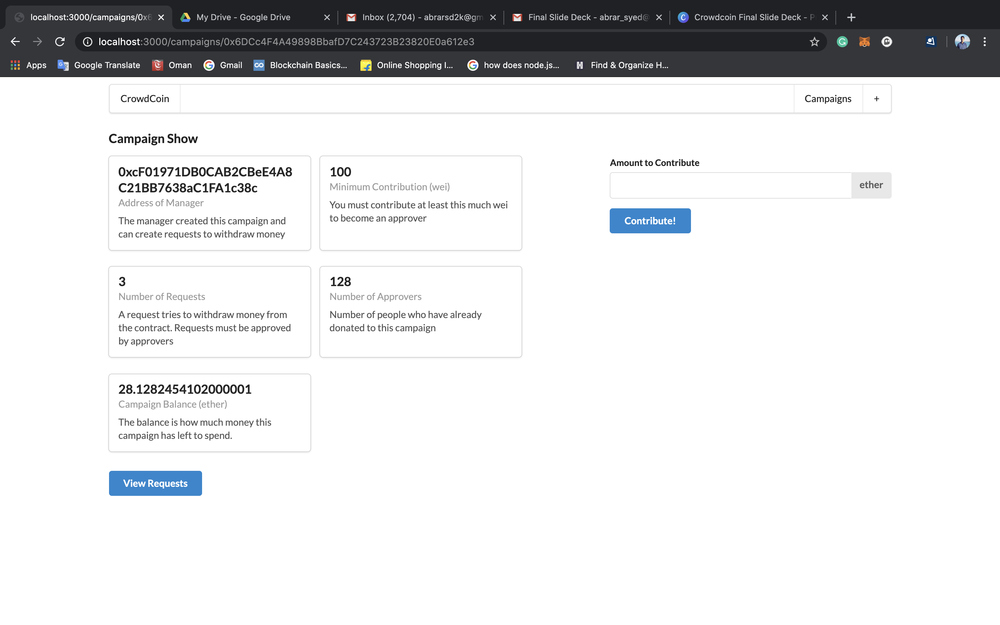
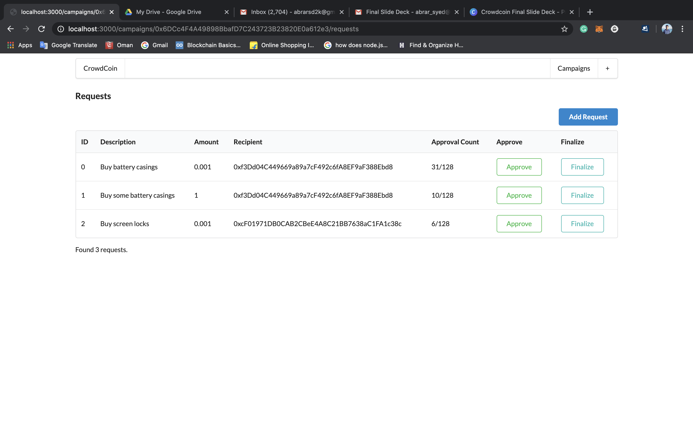

#### This hack's primary aim is to connect an inventor with a funder.

#### Why is the current crowdfunding model not a win-win situation?
Despite their popularity, crowdfunding platforms have been increasingly subjected to scrutiny by investors. This is mainly due to most start-ups not living up to their projected growth. Large projects were found to be completely obsolete after a couple of years and investors (mainly community backers) lost their hard earned money.
Last but not least, crowdfunding mainly favours emerging companies. The backers from the early stages can’t really share the success of the company they invested in. They either had a beta product with discount or had early access to production level assets. However, when a company that was crowdfunded is sold for millions or billions, backers do not gain any profits.

#### Key Challenges in Crowdfunding 
Crowdfunding poses major challenges to backers/investors and creators just the same. The situation prevalent was such that backers had virtually no protection for their investment and were unprotected from failed projects. There wasn’t any security of the money invested. One such instance was CST-01 , a revolutionary e-ink watch by Central Standard Timing. As per its Kickstarter page, the watch was touted to be the world’s thinnest watch, and raised over US$ 1 Million from 7,658 backers on Kickstarter.The watch hit rough waters almost immediately after raising funds in 2013. After virtually no updates for years, the company behind the project filed for bankruptcy in 2016 , taking along with it the trust and hard-earned money of backers.
As for creators, most crowdfunding platforms made it mandatory for investors to be in the same geographical location or country as the start-up. This majorly curtailed scope of global fund raising through crowdfunding. The extensive paperwork and legal compliances further added to their woes. Furthermore, tax burdens on investments were eating into their funds as well. In short, a creator had access to only a maximum of 80% of the funds they amassed, while the rest would go to fees and taxes and regulatory compliance costs. This left them with no other choice but to raise fresh crowdfunding requests very often which was not in the interests of backers because they wanted proven results before further investments were made.

#### What do we propose?
With this hack, we aim to establish a direct peer to peer connection between the funder and the inventor. A vendor makes a request which is sent to gain approval by the network of funders. Once approved, money is then sent via smart contracts which holds and releases finances to the vendor. If the request is not approved, finances will not be sent to the vendor.  In utilizing digital ledger technology, each step of a vendor's process which requires additional funding will display how the backers investment is spent. Each step of a contract must be completed for additional finances to be received. This process ensures accountability and transparency in every step of the process. 

#### Code Details :
All smart contracts in ethereum folder under contracts folder. (/ethereum/contracts/Campaign.sol)

Web app related code under pages folder in index.js (/pages/index.js)

#### How to run this web application ?
1. Clone this repository on to your system and make sure you are in the same directory in terminal.
2. Run  npm install to download any missing dependencies in your system.
3. Now run the server by the command  npm run start .
4. It will start on localhost. 
5. Open localhost in your browser and see the working . 

#### We are also applying under the Domain Category
The domain: http://staysafeanddonatesafewithus.online/
(View on Mobile)

#### The UI path's related images can be seen in images folder under the names ui1 and ui2

#### DEMO Link : https://youtu.be/-NZpb5ABzpg

#### We have also included screenshots of the web app into our repo for your reference.

#### Future plan: We plan to extend this project by developing a supply chain management system for the delivery of the purchased item and also creating a sustainable business model around it.

